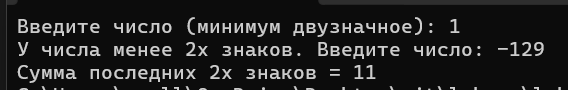
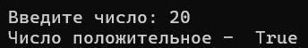
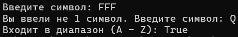
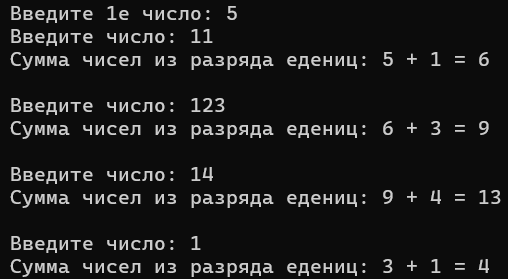

# Галловай Алёна ЛА2 Лабораторная №1

# Задание 1

## Задача 2

### Текст задачи

Дана сигнатура метода: public int sumLastNums (int x);
Необходимо реализовать метод таким образом, чтобы он возвращал результат
сложения двух последних знаков числах, предполагая, что знаков в числе не
менее двух. 

### Алгоритм решения
Взять число по модулю, для корректной обработки отрицательных знач. Чтобы найти последний знак надо найти остаток числа от деления на 10. Для 2го последнего знака берем целую часть от деления на 10 и как в пред.действии остаток от деления на 10. Сложить полученные числа.

### Тестирование

## Задача 4

### Текст задачи

Дана сигнатура метода: public bool isPositive (int x);
Необходимо реализовать метод таким образом, чтобы он принимал число x и
возвращал true, если оно положительное. 

### Алгоритм решения

Проверить является ли число строго больше 0, если оно положительное - вернет true. Иначе число не положительное - вернет false.

### Тестирование

## Задача 6

### Текст задачи

Дана сигнатура метода: public bool isUpperCase (char x);
Необходимо реализовать метод таким образом, чтобы он принимал символ x и
возвращал true, если это большая буква в диапазоне от ‘A’ до ‘Z’. 

### Алгоритм решения

Проверить введенный символ есть ли он в строке "QWERTYUIOPASDFGHJKLZXCVBNM" и вывести true.

### Тестирование

## Задача 8

### Текст задачи

Дана сигнатура метода: public bool isDivisor (int a, int b);
Необходимо реализовать метод таким образом, чтобы он возвращал true, если
любое из принятых чисел делит другое нацело.

### Алгоритм решения

Проверить делятся ли числа друг на друга нацело.

### Тестирование

## Задача 10

### Текст задачи

Дана сигнатура метода: public int lastNumSum(int a, int b)
Необходимо реализовать метод таким образом, чтобы он считал сумму цифр
двух чисел из разряда единиц. Выполните с его помощью последовательное
сложение пяти чисел и результат выведите на экран. Постарайтесь выполнить
задачу, используя минимально возможное количество вспомогательных
переменных.

### Алгоритм решения

Сам метод просто находит сумму остатков двух чисел. Дальше делаем счётчик кол-ва запусков сложений при этом сначала до цикла вводится 1 число и уже в самом цикле тоже просят ввести число. Также запоминаем текущую сумму просто для понятного вывода. Ну и используя написанный метод каждый раз перезаписываем переменную с суммой (для использования меньшего кол-ва переменных) в конце счетчик увеличивается, пока не сложаться 5 чисел.

### Тестирование

# Задание 2

## Задача 2

### Текст задачи

Дана сигнатура метода: public double safeDiv (int x, int y);
Необходимо реализовать метод таким образом, чтобы он возвращал деление x
на y, и при этом гарантировал, что не будет выкинута ошибка деления на 0. При
делении на 0 следует вернуть из метода число 0. Подсказка: смотри
ограничения на операции типов данных. 

### Алгоритм решения

Алгоритм решения задачи

### Тестирование

Скриншоты результата работы программы

## Задача 4

### Текст задачи

Дана сигнатура метода: public String makeDecision (int x, int y);
Необходимо реализовать метод таким образом, чтобы он возвращал строку,
которая включает два принятых методом числа и корректно выставленный
знак операции сравнения (больше, меньше, или равно).

### Алгоритм решения

Алгоритм решения задачи

### Тестирование

Скриншоты результата работы программы

## Задача 6

### Текст задачи

Дана сигнатура метода: public bool sum3 (int x, int y, int z);
Необходимо реализовать метод таким образом, чтобы он возвращал true, если
два любых числа (из трех принятых) можно сложить так, чтобы получить
третье. 

### Алгоритм решения

Алгоритм решения задачи

### Тестирование

Скриншоты результата работы программы

## Задача 8

### Текст задачи

Дана сигнатура метода: public String age (int x);
Необходимо реализовать метод таким образом, чтобы он возвращал строку, в
которой сначала будет число х, а затем одно из слов:
год
года
лет
Слово “год” добавляется, если число х заканчивается на 1, кроме числа 11.
Слово “года” добавляется, если число х заканчивается на 2, 3 или 4, кроме чисел
12, 13, 14.
Слово “лет”добавляется во всех остальных случаях.
Подсказка: оператор % позволяет получить остаток от деления.

### Алгоритм решения

Алгоритм решения задачи

### Тестирование

Скриншоты результата работы программы

## Задача 10

### Текст задачи

Дана сигнатура метода: public void printDays (String x);
В качестве параметра метод принимает строку, в которой записано название
дня недели. Необходимо реализовать метод таким образом, чтобы он выводил
на экран название переданного в него дня и всех последующих до конца недели
дней. Если в качестве строки передан не день, то выводится текст “это не день
недели”. Первый день понедельник, последний – воскресенье. Вместо if в данной
задаче используйте switch.

### Алгоритм решения

Алгоритм решения задачи

### Тестирование

Скриншоты результата работы программы

# Задание 3

## Задача 2

### Текст задачи

Дана сигнатура метода: public String reverseListNums (int x);
Необходимо реализовать метод таким образом, чтобы он возвращал строку, в
которой будут записаны все числа от x до 0 (включительно). 

### Алгоритм решения

Алгоритм решения задачи

### Тестирование

Скриншоты результата работы программы

## Задача 4

### Текст задачи

Дана сигнатура метода: public int pow (int x, int y);
Необходимо реализовать метод таким образом, чтобы он возвращал результат
возведения x в степень y. 

### Алгоритм решения

Алгоритм решения задачи

### Тестирование

Скриншоты результата работы программы

## Задача 6

### Текст задачи

Дана сигнатура метода: public bool equalNum (int x);
Необходимо реализовать метод таким образом, чтобы он возвращал true, если
все знаки числа одинаковы, и false в ином случае. 

### Алгоритм решения

Алгоритм решения задачи

### Тестирование

Скриншоты результата работы программы

## Задача 8

### Текст задачи

Дана сигнатура метода: public void leftTriangle (int x);
Необходимо реализовать метод таким образом, чтобы он выводил на экран
треугольник из символов ‘*’ у которого х символов в высоту, а количество
символов в ряду совпадает с номером строки

### Алгоритм решения

Алгоритм решения задачи

### Тестирование

Скриншоты результата работы программы

## Задача 10

### Текст задачи

Дана сигнатура метода: public void guessGame()
Необходимо реализовать метод таким образом, чтобы он генерировал
случайное число от 0 до 9, далее считывал с консоли введенное пользователем
число и выводил, угадал ли пользователь то, что было загадано, или нет. Метод
запускается до тех пор, пока пользователь не угадает число. После этого
выведите на экран количество попыток, которое потребовалось пользователю,
чтобы угадать число.

### Алгоритм решения

Алгоритм решения задачи

### Тестирование

Скриншоты результата работы программы

# Задание 4

## Задача 2

### Текст задачи

Дана сигнатура метода: public int findLast (int[] arr, int x);
Необходимо реализовать метод таким образом, чтобы он возвращал индекс
последнего вхождения числа x в массив arr. Если число не входит в массив –
возвращается -1.

### Алгоритм решения

Алгоритм решения задачи

### Тестирование

Скриншоты результата работы программы

## Задача 4

### Текст задачи

Дана сигнатура метода: public int[]add (int[] arr, int x, int pos);
Необходимо реализовать метод таким образом, чтобы он возвращал новый
массив, который будет содержать все элементы массива arr, однако в позицию
pos будет вставлено значение x.

### Алгоритм решения

Алгоритм решения задачи

### Тестирование

Скриншоты результата работы программы

## Задача 6

### Текст задачи

Дана сигнатура метода: public void reverse (int[] arr);
Необходимо реализовать метод таким образом, чтобы он изменял массив arr.
После проведенных изменений массив должен быть записан задом-наперед.

### Алгоритм решения

Алгоритм решения задачи

### Тестирование

Скриншоты результата работы программы

## Задача 8

### Текст задачи

Дана сигнатура метода: public int[] concat (int[] arr1,int[] arr2);
Необходимо реализовать метод таким образом, чтобы он возвращал новый
массив, в котором сначала идут элементы первого массива (arr1), а затем
второго (arr2).

### Алгоритм решения

Алгоритм решения задачи

### Тестирование

Скриншоты результата работы программы

## Задача 10

### Текст задачи

Дана сигнатура метода: public int[] deleteNegative (int[] arr);
Необходимо реализовать метод таким образом, чтобы он возвращал новый
массив, в котором записаны все элементы массива arr кроме отрицательных.

### Алгоритм решения

Алгоритм решения задачи

### Тестирование

Скриншоты результата работы программы